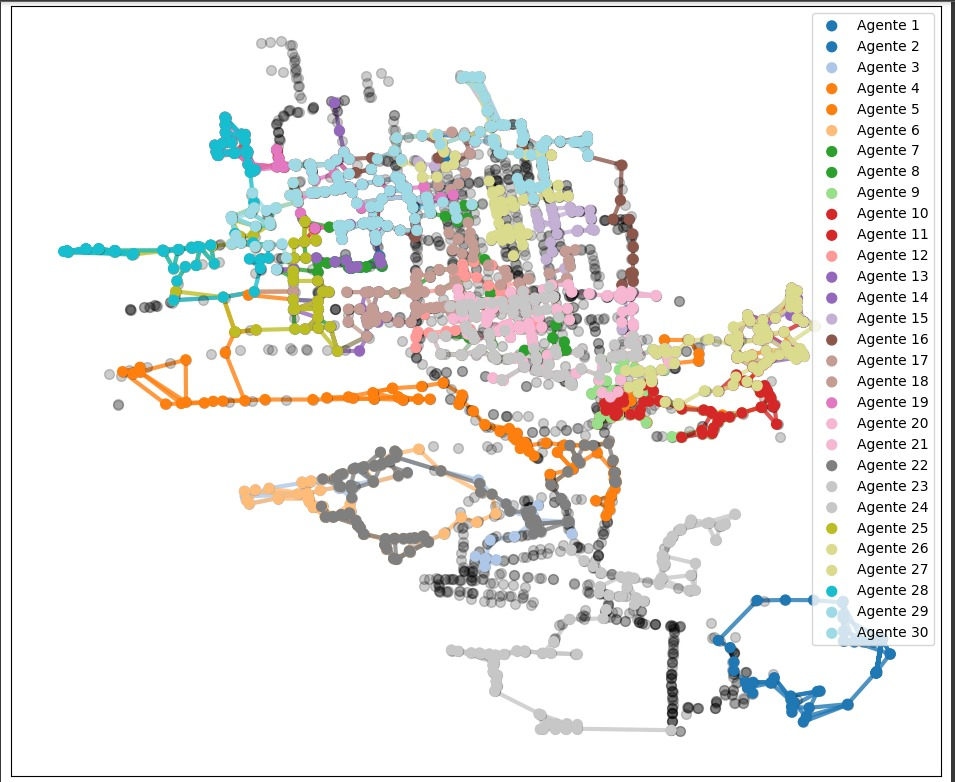

# MultiAgentDeepLearninginPublicTransport

## 📋 Descripción
Este proyecto tiene como objetivo mejorar la eficiencia del sistema de transporte público en Hermosillo, Sonora, aplicando técnicas avanzadas de inteligencia artificial, específicamente el **Aprendizaje por Refuerzo Multiagente (MARL)**. Se busca optimizar tanto el diseño de las rutas como el establecimiento de frecuencias de servicio, mejorando así la experiencia de los usuarios y la operación del sistema.

## 🎯 Objetivos
- 🚍 **Optimización de Rutas:** Rediseñar las rutas actuales para reducir los tiempos de viaje y mejorar la conectividad.
- ⏱️ **Ajuste de Frecuencias:** Implementar un sistema dinámico de frecuencias que se adapte a la demanda de los usuarios en tiempo real.
- 🤖 **Aplicación de MARL:** Utilizar MARL para coordinar múltiples agentes (rutas) en la búsqueda de una solución globalmente eficiente.

## 🚀 Enfoque
El proyecto emplea **MARL**, permitiendo que diferentes rutas (representadas como agentes) aprendan y se coordinen para optimizar el sistema de transporte en su conjunto. Este enfoque se distingue de los métodos tradicionales como los algoritmos genéticos o la programación dinámica, ofreciendo una solución más adaptativa y robusta.

## 📊 Resultados Esperados
- ⏳ **Mejora en la Eficiencia del Transporte:** Reducción en los tiempos de espera y viaje para los usuarios.
- 😃 **Mayor Satisfacción del Usuario:** Mejora en la percepción del servicio por parte de los usuarios.
- 💡 **Optimización del Sistema:** Implementación de un sistema de transporte público más efectivo y adaptado a las necesidades reales de la población.

## ✅ Conclusión
Este proyecto representa un avance significativo en la gestión y operación de sistemas de transporte público utilizando inteligencia artificial. Los resultados obtenidos proporcionarán una base sólida para futuras implementaciones y mejoras en otros contextos urbanos.

